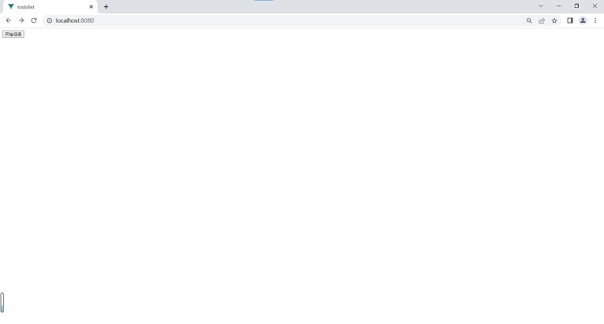
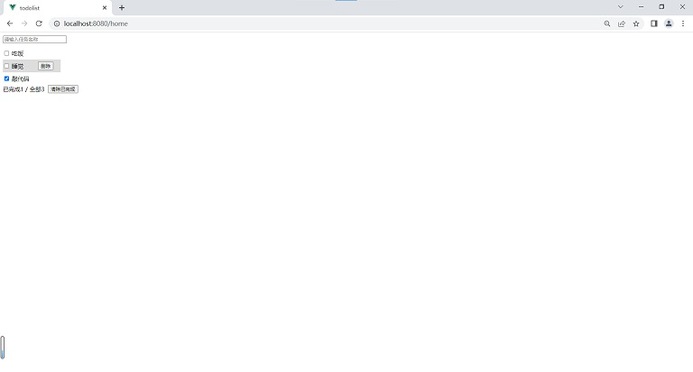
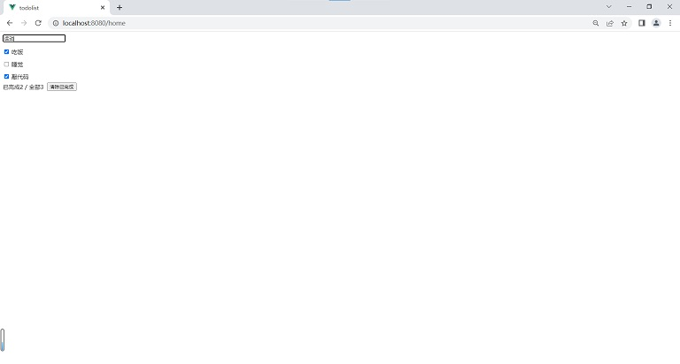
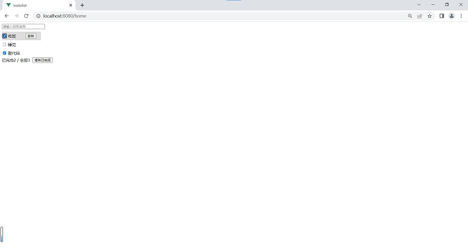
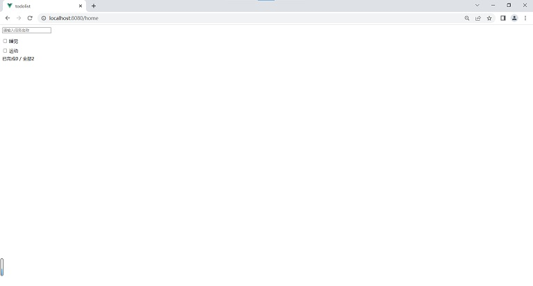

# todolist

实战课程练习，实现一个任务列表组件。

开始页跳转至主页，输入任务名称增加任务项，勾选任务项完成任务，点击每项删除按钮删除任务，点击清除已完成按钮删除已完成任务。











## Project setup
```
npm install
```

### Compiles and hot-reloads for development
```
npm run serve
```

### Compiles and minifies for production
```
npm run build
```

### Customize configuration
See [Configuration Reference](https://cli.vuejs.org/config/).
